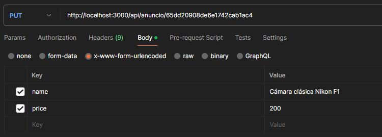
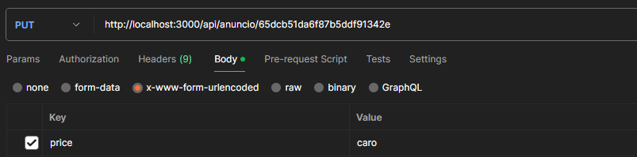
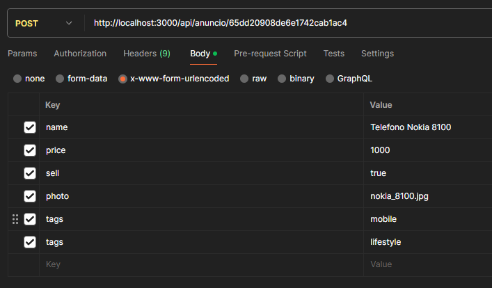
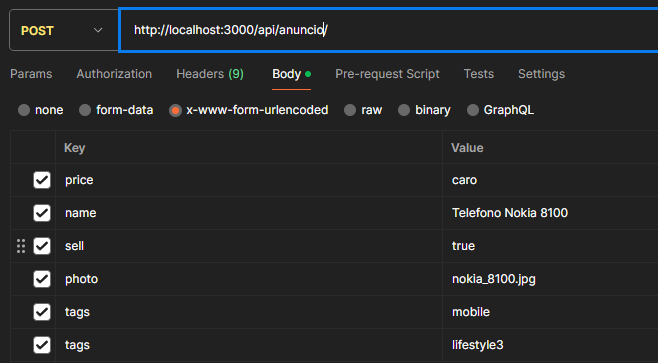
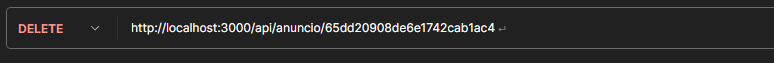
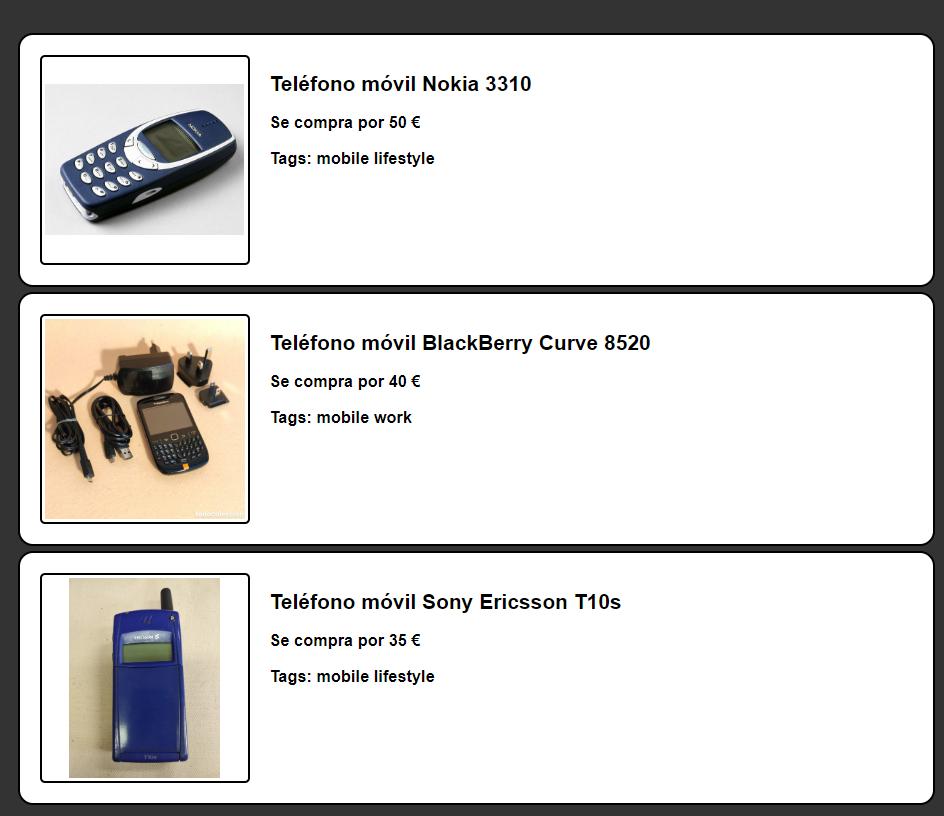
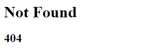
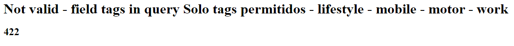

## English

[Español](#Español)

# Nodepop Ad Management API 

📕 This API provides endpoints to manage ads, including getting filtered ads, getting a list of tags in ads, modifying, adding and deleting ads in the database.

## Facility

1. 💻 Clone this repository to your local machine.
2. 👨‍💻 Install the dependencies using `npm install`.
3. 📄 Configure the connection to your `MongoDB` database:

         `mongodb://127.0.0.1:27017/`
4. 🏃‍♂️ Run the server with `npm run initDB` to initialize the database.

     **`ATTENTION: THIS PROCESS DELETES THE PREVIOUS DATA IN THE DATABASE.`**

5. For development run `npm run dev` for deployment `npm run start`

# Use

## API

The API consists of the following endpoints:
<details>
  <summary><code>GET</code> <code><b>/api/anuncios</b></code> <code>(Gets a list of filtered ads.)</code></summary>

### **`GET` /api/ads**
Gets a list of ads filtered based on the given parameters.

#### Query parameters

- `min` Minimum searched price (number).
- `max` Maximum price searched (number).
- `price` Exact price searched (number) This parameter is not compatible with min and max.
- `sell` Buy or sell ad type (boolean).
- `tags` search by tags (text). It can be used multiple times (e.g. ?tag=mobile&tag=work).
- `tittleStart` Search for ads that start with a certain text (text).
- `tittle` Search for ads that contain a certain text (text).
- `sort` Sort the ads. Sort fields:

#### Pagination

- `start` First item displayed (number).
- `step` Number of items displayed (number).


#### 🟢 Example

> ```
> http://localhost:3000/api/anuncio/?tags=mobile&min=30&max=50
> ```

#### 🟢 Result

##### Code `200`

###### Query completed successfully

>```json
>
>{"result":
>    [
>        {"_id":"65dcb51da6f87b5ddf91342f",
>        "name":"Teléfono móvil Nokia 3310",
>        "sell":false,
>        "price":50,
>       "photo":"nokia_3310.jpg",
>       "tags":["mobile","lifestyle"],
>        "__v":0},
>        {"_id":"65dcb51da6f87b5ddf91343b",
>        "name":"Teléfono móvil BlackBerry Curve 8520",
>        "sell":false,
>        "price":40,
>        "photo":"blackberry_curve_8520.jpg",
>        "tags":["mobile","work"],
>        "__v":0},
>        {"_id":"65dcb51da6f87b5ddf913440",
>        "name":"Teléfono móvil Sony Ericsson T10s",
>        "sell":false,"price":35,
>        "photo":"sony_ericsson_t10s.jpg",
>        "tags":["mobile","lifestyle"],
>        "__v":0}
>    ]
>}
>
>```


#### 🟢 Example

> ```
> http://localhost:3000/api/telefonos/?tags=informatica&min=30&max=50
> ```

##### Code `404`

###### Not found

>```json
>{
>    "error": "Not Found"
>}
>```

#### 🟢 Example

> ```
> http://localhost:3000/api/anuncio/?tags=informatica&min=30&max=50
> ```

##### Code `422`

###### Validation error

```json
{
    "error": "Not valid - field {field} in query solo tags permitidos - lifestyle - mobile  - motor - work"
}
```

</details>

<details>
 <summary><code>GET</code> <code><b>/api/anuncios/tags</b></code> <code>(Gets a list of ad tags.)</code></summary>

### **`GET` /api/anuncios/tags**

Gets a list of tags included in the ads.

#### 🟢 Example

> ```
>  http://localhost:3000/api/anuncio/tags
> ```

#### 🟢 Result

##### Code `200`

###### Query completed successfully

>```json
>    {"result":
>        [
>            "lifestyle",
>            "mobile",
>            "motor",
>            "work"
>        ]
>    }
>```

#### 🟢 Example

> ```
>  http://localhost:3000/api/telefonos/?tags=informatica&min=30&max=50
> ```  

##### Code `404`

###### Not found

>```json
>{
>    "error": "Not Found"
>}
>```

</details>

<details>
 <summary><code>PUT</code> <code><b>/api/anuncios/:id</b></code> <code>(Modify an ad)</code></summary>

### **`PUT` /api/anuncios/:id**

Modify an ad by passing the id as a parameter

#### 🟢 Example
> ```
>  http://localhost:3000/api/anuncio/65dd20908de6e1742cab1ac4
> ```
>

#### Previous

>```json
>{
>    "result": {
>        "name": "Cámara clásica Nikon F1",
>        "sell": true,
>        "price": 21,
>        "photo": "nikonF1.jpg",
>        "tags": [
>            "lifestyle"
>        ],
>        "_id": "65dd20908de6e1742cab1ac4",
>        "__v": 0
>    }
>}
>```

##### Code `200`

###### Update completed successfully

#### 🟢 Result

>```json
>{
>    "result": {
>        "_id": "65dd20908de6e1742cab1ac4",
>        "name": "Cámara clásica Nikon F1",
>        "sell": true,
>        "price": 200,
>        "photo": "nikonF1.jpg",
>        "tags": [
>            "lifestyle"
>        ],
>        "__v": 0
>    }
>}
>```
#### 🟢 Example

> ```
> http://localhost:3000/api/65dd20908de6e1742cab1ac4/
> ```

##### Code `404`

###### Not found

>```json
>{
>    "error": "Not Found"
>}
>```

#### 🟢 Example

>```

##### Code `422`

###### Validation error

>```json
>{
>    "error": "Not valid - field price in body debe ser un numero"
>}
>```

 </details>
<details>
 <summary><code>POST</code> <code><b>/api/anuncios/</b></code> <code>(Add a new ad)</code></summary>

### **`POST` /api/anuncios/**

This endpoint adds a new advertisement following the following scheme.

### 🟢 Schema

>```javascript
>Schema({
>    name: {type:String,required:true},
>    sell: {type:Boolean,required:true,},
>    price: {type:Number,required:true,},
>    photo: {type:String,required:true},
>    tags: {type:[String],required:true,enum: {
>        values: ["lifestyle", "mobile", "motor", "work"],
>    }},
>});
>```

#### 🟢 Example


>

#### 🟢 Result

##### Code `200`

###### Document created successfully

>```json
>{
>    "result": {
>        "name": "Telefono Nokia 8100",
>        "sell": true,
>        "price": 1000,
>        "photo": "nokia_8100.jpg",
>        "tags": [
>            "mobile",
>            "lifestyle"
>        ],
>        "_id": "65dd3d984a5d35e0578c5afc",
>        "__v": 0
>    }
>}
>```
#### 🟢 Example

>

##### Code `404`

###### Not found

>```json
>{
>    "error": "Not Found"
>}
>```

#### 🟢 Example

>

##### Code `422`

###### Validation error

>```json
>{
>    "error": "Not valid - field price in body debe ser un numero"
>}
>```

</details>
<details>
 <summary><code>DELETE</code> <code><b>/api/anuncios/:id</b></code> <code>(Delete an ad)</code></summary>

### **`DELETE` /api/anuncios/:id**

Delete an ad from the database, receiving the ad id as a parameter

#### 🟢 Example

>

> This method does not return anything

</details>

## Website

<details>
 <summary><code>GET</code> <code><b>/</b></code> <code>(Gets a list of filtered ads.)</code></summary>

### **`GET` /**
Gets a list of ads filtered based on the given parameters.

#### Query parameters

- `min` Minimum searched price (number).
- `max` Maximum price searched (number).
- `price` Exact price searched (number) This parameter is not compatible with min and max.
- `sell` Buy or sell ad type (boolean).
- `tags` search by tags (text). It can be used multiple times (e.g. ?tag=mobile&tag=work).
- `tittleStart` Search for ads that start with a certain text (text).
- `tittle` Search for ads that contain a certain text (text).

#### Pagination

- `start` First item displayed (number).
- `step` Number of items displayed (number).


#### 🟢 Example

> ```
>  http://localhost:3000/?tags=mobile&min=30&max=50
> ```

#### 🟢 Result

##### Code `200`

###### Query completed successfully

>


#### 🟢 Example

> ```
> http://localhost:3000/telefonos/?tags=informatica&min=30&max=50
> ```

##### Code `404`

###### Not found

>

#### 🟢 Example

> ```
> http://localhost:3000/?tags=informatica&min=30&max=50
> ```

##### Code `422`

###### Validation error

>

</details>

## Español

[English](#English)

# API de Gestión de anuncios Nodepop 

📕 Esta API proporciona endpoints para gestionar anuncios, incluyendo la obtención de anuncios filtrados, la obtención de una lista de tags en los anuncios, la modificación, agregación y eliminación de anuncios en la base de datos.

## Instalación

1. 💻 Clona este repositorio en tu máquina local.
2. 👨‍💻 Instala las dependencias utilizando `npm install`.
3. 📄 Configura la conexión a tu base de datos `MongoDB`:

        `mongodb://127.0.0.1:27017/`
4. 🏃‍♂️ Ejecuta el servidor con `npm run initDB` para inicializar la base de datos.

    **`ATENCIÓN: ESTE PROCESO BORRA LOS DATOS PREVIOS EN LA BASE DE DATOS.`**

5. Para desarrollo ejecuta `npm run dev` para despliegue `npm run start`

# Uso

## API

La API consta de los siguientes endpoints:
<details>
 <summary><code>GET</code> <code><b>/api/anuncios</b></code> <code>(Obtiene una lista de anuncios filtrados.)</code></summary>

### **`GET` /api/anuncios**
Obtiene una lista de anuncios filtrados según los parámetros proporcionados.

#### Parámetros de consulta

- `min` Precio mínimo buscado (número).
- `max` Precio máximo buscado (número).
- `price` Precio exacto buscado (numero) Este parámetro no es compatible con min y max.
- `sell` Tipo de anuncio  compra o venta (boolean).
- `tags` busqueda por tags (texto). Se puede usar varias veces (ej. ?tag=mobile&tag=work).
- `tittleStart` Busca anuncios que empiezan por un determinado texto (texto).
- `tittle` Busca anuncios que contienen un determinado texto (texto).
- `sort` Ordena los anuncios. Campos de ordenación: 

#### Paginaciòn

- `start` Primer artículo mostrado (número).
- `step` Número de artículos mostrados (número).


#### 🟢 Ejemplo

> ```
>  http://localhost:3000/api/anuncio/?tags=mobile&min=30&max=50
> ```

#### 🟢 Resultado

##### Code `200`

###### Consulta realizada con éxito

>```json
>
>{"result":
>    [
>        {"_id":"65dcb51da6f87b5ddf91342f",
>        "name":"Teléfono móvil Nokia 3310",
>        "sell":false,
>        "price":50,
>       "photo":"nokia_3310.jpg",
>       "tags":["mobile","lifestyle"],
>        "__v":0},
>        {"_id":"65dcb51da6f87b5ddf91343b",
>        "name":"Teléfono móvil BlackBerry Curve 8520",
>        "sell":false,
>        "price":40,
>        "photo":"blackberry_curve_8520.jpg",
>        "tags":["mobile","work"],
>        "__v":0},
>        {"_id":"65dcb51da6f87b5ddf913440",
>        "name":"Teléfono móvil Sony Ericsson T10s",
>        "sell":false,"price":35,
>        "photo":"sony_ericsson_t10s.jpg",
>        "tags":["mobile","lifestyle"],
>        "__v":0}
>    ]
>}
>
>```


#### 🟢 Ejemplo

> ```
>  http://localhost:3000/api/telefonos/?tags=informatica&min=30&max=50
> ```  

##### Code `404`

###### No encontrado

>```json
>{
>    "error": "Not Found"
>}
>```

#### 🟢 Ejemplo

> ```
>  http://localhost:3000/api/anuncio/?tags=informatica&min=30&max=50
> ```

##### Code `422`

###### Error de validación

```json
{
    "error": "Not valid - field {field} in query solo tags permitidos - lifestyle - mobile  - motor - work"
}
```

</details>

<details>
 <summary><code>GET</code> <code><b>/api/anuncios/tags</b></code> <code>(Obtiene una lista de tags los anuncios.)</code></summary>

### **`GET` /api/anuncios/tags**

Obtiene una lista de tags incluidos en los anuncios.

#### 🟢 Ejemplo

> ```
>  http://localhost:3000/api/anuncio/tags
> ```

#### 🟢 Resultado

##### Code `200`

###### Consulta realizada con éxito

>```json
>    {"result":
>        [
>            "lifestyle",
>            "mobile",
>            "motor",
>            "work"
>        ]
>    }
>```

#### 🟢 Ejemplo

> ```
>  http://localhost:3000/api/telefonos/?tags=informatica&min=30&max=50
> ```  

##### Code `404`

###### No encontrado

>```json
>{
>    "error": "Not Found"
>}
>```

</details>

<details>
 <summary><code>PUT</code> <code><b>/api/anuncios/:id</b></code> <code>(Modifica un anuncio)</code></summary>

### **`PUT` /api/anuncios/:id**

Modifica un anuncio pasando el id como parámetro

#### 🟢 Ejemplo

> ```
>  http://localhost:3000/api/anuncio/65dd20908de6e1742cab1ac4
> ```
>

#### Previo

>```json
>{
>    "result": {
>        "name": "Cámara clásica Nikon F1",
>        "sell": true,
>        "price": 21,
>        "photo": "nikonF1.jpg",
>        "tags": [
>            "lifestyle"
>        ],
>        "_id": "65dd20908de6e1742cab1ac4",
>        "__v": 0
>    }
>}
>```

##### Code `200`

###### Actualización realizada con éxito

#### 🟢 Resultado

>```json
>{
>    "result": {
>        "_id": "65dd20908de6e1742cab1ac4",
>        "name": "Cámara clásica Nikon F1",
>        "sell": true,
>        "price": 200,
>        "photo": "nikonF1.jpg",
>        "tags": [
>            "lifestyle"
>        ],
>        "__v": 0
>    }
>}
>```
#### 🟢 Ejemplo

> ```
>  http://localhost:3000/api/65dd20908de6e1742cab1ac4/
> ```  

##### Code `404`

###### No encontrado

>```json
>{
>    "error": "Not Found"
>}
>```

#### 🟢 Ejemplo

>```

##### Code `422`

###### Error de validación

>```json
>{
>    "error": "Not valid - field price en body debe ser un numero"
>}
>```

 </details>
<details>
 <summary><code>POST</code> <code><b>/api/anuncios/</b></code> <code>(Añade un nuevo anuncio)</code></summary>

### **`POST` /api/anuncios/**

Este endpoint añade un nuevo anuncio siguiendo el siguiente esquema.

### 🟢 Schema

>```javascript
>Schema({
>    name: {type:String,required:true},
>    sell: {type:Boolean,required:true,},
>    price: {type:Number,required:true,},
>    photo: {type:String,required:true},
>    tags: {type:[String],required:true,enum: {
>        values: ["lifestyle", "mobile", "motor", "work"],
>    }},
>});
>```

#### 🟢 Ejemplo


>

#### 🟢 Resultado

##### Code `200`

###### Documento creado con exito

>```json
>{
>    "result": {
>        "name": "Telefono Nokia 8100",
>        "sell": true,
>        "price": 1000,
>        "photo": "nokia_8100.jpg",
>        "tags": [
>            "mobile",
>            "lifestyle"
>        ],
>        "_id": "65dd3d984a5d35e0578c5afc",
>        "__v": 0
>    }
>}
>```
#### 🟢 Ejemplo

>

##### Code `404`

###### No encontrado

>```json
>{
>    "error": "Not Found"
>}
>```

#### 🟢 Ejemplo

>

##### Code `422`

###### Error de validación

>```json
>{
>    "error": "Not valid - field price in body debe ser un numero"
>}
>```

</details>
<details>
 <summary><code>DELETE</code> <code><b>/api/anuncios/:id</b></code> <code>(Elimina un anuncio)</code></summary>

### **`DELETE` /api/anuncios/:id**

Elimina un anuncio de la base de datos recibiendo por parametro el id del anuncio

#### 🟢 Ejemplo

>

#### 🟢 Resultado

> Este método no devuelve nada

</details>

## Website

<details>
 <summary><code>GET</code> <code><b>/</b></code> <code>(Obtiene una lista de anuncios filtrados.)</code></summary>

### **`GET` /**
Obtiene una lista de anuncios filtrados según los parámetros proporcionados.

#### Parámetros de consulta

- `min` Precio mínimo buscado (número).
- `max` Precio máximo buscado (número).
- `price` Precio exacto buscado (numero) Este parámetro no es compatible con min y max.
- `sell` Tipo de anuncio  compra o venta (boolean).
- `tags` busqueda por tags (texto). Se puede usar varias veces (ej. ?tag=mobile&tag=work).
- `tittleStart` Busca anuncios que empiezan por un determinado texto (texto).
- `tittle` Busca anuncios que contienen un determinado texto (texto).

#### Paginaciòn

- `start` Primer artículo mostrado (número).
- `step` Número de artículos mostrados (número).


#### 🟢 Ejemplo

> ```
>  http://localhost:3000/?tags=mobile&min=30&max=50
> ```

#### 🟢 Resultado

##### Code `200`

###### Consulta realizada con exito

>


#### 🟢 Ejemplo

> ```
>  http://localhost:3000/telefonos/?tags=informatica&min=30&max=50
> ```  

##### Code `404`

###### No encontrado

>

#### 🟢 Ejemplo

> ```
>  http://localhost:3000/?tags=informatica&min=30&max=50
> ```

##### Code `422`

###### Error de validación

>

</details>
